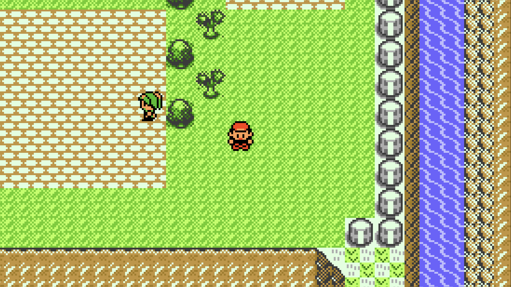
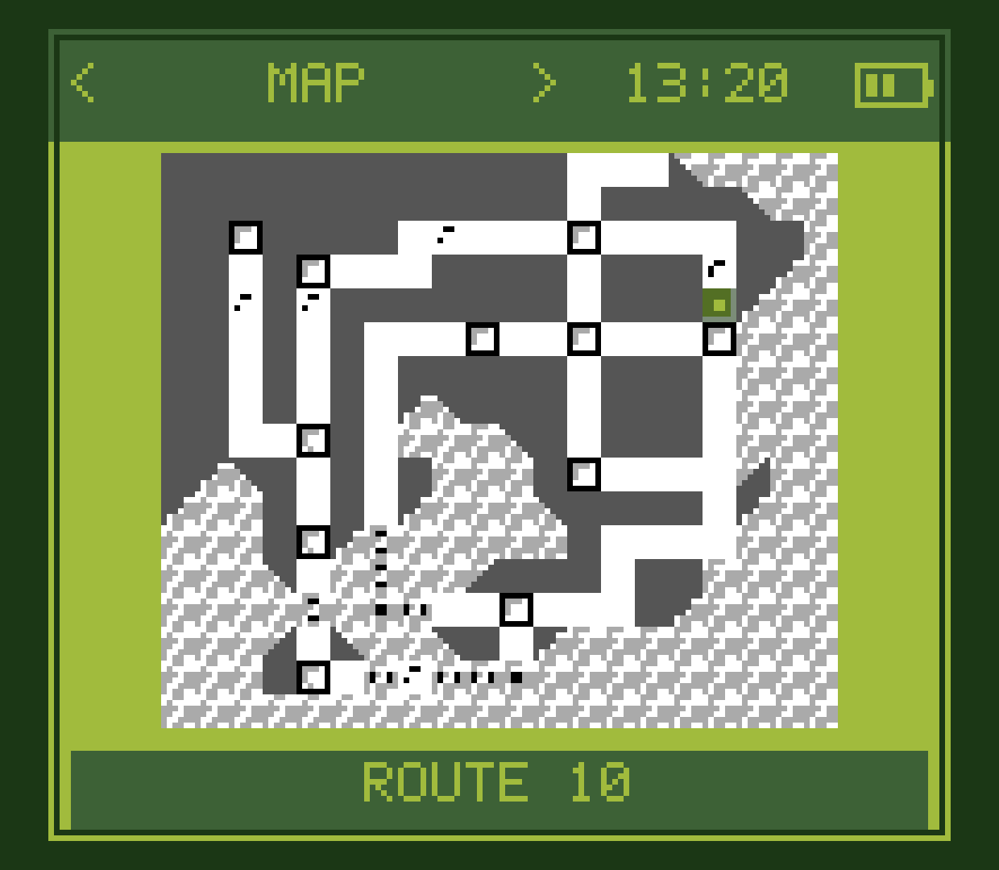
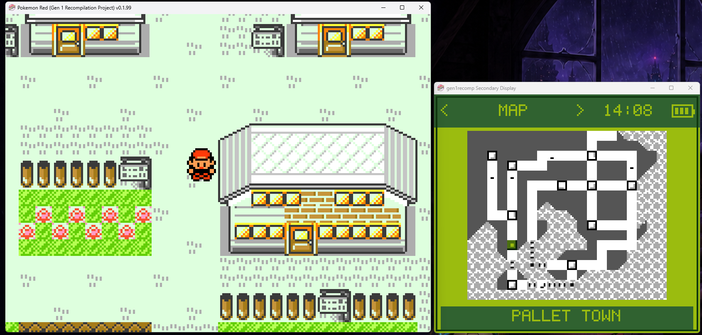
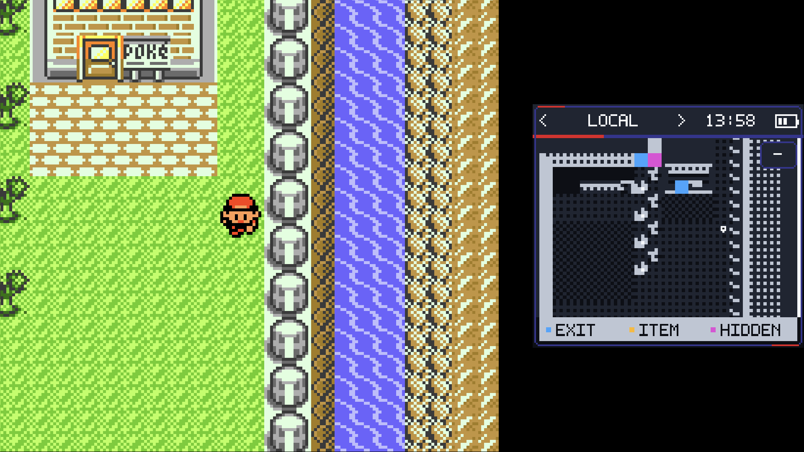

# Kanto Gear

### A second screen when you have one. A better layout when you do not.

Kanto Gear adds maps, party data, battle controls and touch-friendly tools to
[Gen1Recomp](https://github.com/bryanthaboi/gen1recomp). It works on one screen,
inside a combined layout, or on a dedicated second display.

  
  
  

  
  
  

<strong><a href="https://github.com/AverageConsumer/kanto-gear/releases/tag/v2.1.0">Download Kanto Gear</a></strong> · <strong><a href="#install">Install</a></strong> · <strong><a href="https://github.com/AverageConsumer/kanto-gear/issues">Report a problem</a></strong>

## Pick your setup

Kanto Gear is not tied to one handheld or one screen arrangement. Choose the
layout that fits the device in front of you.

| Your setup | Use this mode | What you get |
| --- | --- | --- |
| **Phone or small one-screen handheld** | **Single Screen** | Keep the game fullscreen and swap to Kanto Gear only when you need it. |
| **Steam Deck, desktop or larger one-screen device** | **Combined Screen** | Put both views side by side, stack them, or use a movable overlay. |
| **AYN Thor, RG DS or another dual-screen handheld** | **Dual Screen** | Keep the game on one display and give Kanto Gear the other. |
| **Retroid Dual Screen Add-on, monitor, dock or TV** | **Dual Screen** | Route Kanto Gear to the selected Android display or move its desktop window wherever you want. |

### A real companion display

  
  

The two images above are direct captures from the primary and secondary
displays of an AYN Thor running the official Gen1Recomp host. On Android, Kanto
Gear can follow a selected physical display and recover live if that display is
disconnected.

### A normal companion window on desktop

  

On desktop, Dual Screen mode opens Kanto Gear as a normal companion window.
Keep it beside the game, move it to another monitor or size both windows around
the rest of your desktop. Windows 11 is tested; Linux packages use the same
desktop-window path and welcome real-device reports.

### One screen still gets both views

  

Single Screen mode gives the entire display to one view and swaps on demand.
Combined Screen mode keeps both visible with side-by-side, stacked and overlay
layouts. The game viewport and Android touch controls adapt with the layout,
and the companion size can be tuned without stretching its UI.

## What Kanto Gear adds

Kanto Gear gives Pokémon Red, Blue, Yellow and Gold a configurable companion
display without changing the game underneath it.

- Explore with a live region map, detailed local maps, exits and item markers.
- Check your party, Trainer Card, badges, Pokédex progress, steps and area data.
- Use contextual touch controls for battles, bags, dialogue, PC boxes and moves.
- Move battle controls—or the complete battle HUD—to the second screen.
- Swap views, hide an overlay or move the companion between displays.
- Choose classic Game Boy-inspired or modern light and dark themes.

Display changes and disconnects are handled live, so the game remains reachable
when a second display disappears.

## What you need

Kanto Gear 2.1 works with the official Gen1Recomp 0.1.99 release or newer. No
custom host or Voxel renderer is required for new installations.

| Download | Required | Purpose |
| --- | :---: | --- |
| [Gen1Recomp 0.1.99 or newer](https://github.com/bryanthaboi/gen1recomp/releases/latest) | **Yes** | Official host and platform packages |
| [Kanto Gear 2.1.0](https://github.com/AverageConsumer/kanto-gear/releases/tag/v2.1.0) | **Yes** | Companion UI and display modes |
| [Kanto Gear Deutsch 0.2.3](https://github.com/AverageConsumer/kanto-gear/releases/tag/v2.1.0) | No | German text for the Kanto Gear interface |
| [Kanto Gear Español (España) 0.2.3](https://github.com/AverageConsumer/kanto-gear/releases/tag/v2.1.0) | No | Spanish (Spain) text for the Kanto Gear interface |

> [!IMPORTANT]
> Gen1Recomp 0.1.99 is the first official release containing Kanto Gear's full
> display and mod API requirements. The exact legacy Android host
> `0.1.94-kanto.22` remains accepted only as a save-migration bridge.

## Install

You need your own supported Pokémon Red, Blue, Yellow or Gold ROM. No ROM or
ROM-extracted game data is included.

1. Install the [latest official Gen1Recomp release](https://github.com/bryanthaboi/gen1recomp/releases/latest)
   for your platform.
2. Download [Kanto Gear 2.1.0](https://github.com/AverageConsumer/kanto-gear/releases/tag/v2.1.0).
3. Open the host's **MODS → Import mod .zip** screen and select the Kanto Gear
   ZIP.
4. Enable **Kanto Gear** and start the game. Choose a display mode in Kanto
   Gear's settings.

For a German or Spanish Kanto Gear interface, import the matching optional
`kanto_gear_de-0.2.3.zip` or `kanto_gear_es-0.2.3.zip` from the same release.
Other translations can use the small
[language-pack template](translations/README.md).

Use Gen1Recomp's normal update path for later official releases. Keep an
exported save backup before changing hosts or operating systems.

> [!WARNING]
> The former **Gen1Recomp Kanto host** and the official Android app use separate
> app identities, so the official app installs beside it and cannot see its
> private saves or installed mods. Export your save from the old host first,
> then import the ROM, save and Kanto Gear into the official app. Do not remove
> the old host until the migrated save has been verified.
>
> Gen1Recomp 0.1.99 cannot export a Pokémon Gold cartridge `.sav` yet. Gold
> players should keep the legacy host installed and continue there until an
> upstream Gen 2 transfer path is available. Kanto Gear 2.1 remains compatible
> with the final legacy host for this reason; the host itself is frozen and
> will receive no further feature releases.

### Voxel renderers

Kanto Gear does not require or bundle a Voxel renderer. Our former
[Dramatic Shape Android fork](https://github.com/AverageConsumer/DramaticShapeVoxelMod)
is frozen at `1.7.0-android.1` and no longer maintained. Its release remains
available for existing users, but it will not receive upstream, compatibility,
feature or support updates and is not part of the current matched release set.

Other renderer forks may work, but compatibility belongs to their current
maintainers. Do not install multiple Dramatic Shape variants together because
they intentionally share the same mod ID.

## Display mode reference

- **Single Screen** keeps one view fullscreen and lets you swap to the other.
- **Combined Screen** places both views in one window: side by side, stacked or
  as a movable overlay with adjustable size.
- **Dual Screen** uses Android's selected display or opens a separate desktop
  companion window that can be moved like any other window.

The game viewport and Android touch controls remain usable when a combined
layout makes the game view smaller.

## Tested devices

### Supported devices

- **AYN Thor** — primary development and test device
- **Retroid Pocket 5 + Retroid Dual Screen Add-on** — community tested
- **Anbernic RG DS** — community confirmed specifically with GammaOS Nano 1.4
  (Android 14). Avoid other performance-heavy mods on its lower-power hardware.
- **Anbernic RG DS with Rocknix** — the dual-screen and touch route was
  community confirmed with the earlier diagnostic PortMaster build; the final
  2.0 package remains experimental until it receives a fresh confirmation.
- **Windows 11** — combined layouts and a separate companion window tested
- **Linux x86_64 and ARM64** — packages embed the exact Android/Windows-tested
  payload and pass structural verification; real-device reports are welcome
- **External Android displays, docks and TVs** — supported through selectable
  display routing; hardware reports are welcome

macOS uses the same desktop display path through the universal `.love` package,
but it is not presented as a tested or signed native app bundle.

## Quick controls

| Action | Control |
| --- | --- |
| Change Kanto Gear page | Swipe left/right or tap the header arrows |
| Swap the two displays | Enable **SCREEN SWAP (Y)**, then press **Y** |
| Cycle pages with a controller | Enable **TRIGGER TABS**, then use L2/R2 |
| Zoom the local map | Tap **+ / −** |
| Open Kanto Gear settings with Modern UI | **MOD MENUS → KANTO GEAR** |

Useful settings:

- **DISPLAY MODE → DUAL SCREEN** is recommended on dual-screen handhelds.
- **DISPLAY MODE → COMBINED SCREEN** is recommended on one-screen devices.
- **SCREEN SWAP (Y)** is off by default so other mods can use **Y**.
- **BATTLE VIEW → STANDARD** keeps the original battle HUD.
- **BATTLE VIEW → GEAR** moves duplicated battle controls.
- **BATTLE VIEW → FULL GEAR** also moves HP and status panels.
- **INFO → PURIST** hides assistance; **ENHANCED** enables it.

## Compatibility and support

Kanto Gear 2.1 requires the official Gen1Recomp 0.1.99 release or newer. The
exact legacy host `0.1.94-kanto.22` remains supported temporarily for Android
save migration only. Keep an exported save backup while testing experimental
display layouts or platform packages.

Open a [Kanto Gear issue](https://github.com/AverageConsumer/kanto-gear/issues)
for second-display, touch or companion-UI problems. Include your device,
operating system, display setup, installed versions and a screenshot if useful.

Include the official host version in Kanto Gear reports. General host startup
problems belong to the [Gen1Recomp issue tracker](https://github.com/bryanthaboi/gen1recomp/issues).
Problems exclusive to a third-party 3D renderer belong to its current
maintainer. Our legacy Dramatic Shape Android fork is retained only as an
unsupported historical download.

## Credits

Kanto Gear is built on [Gen1Recomp](https://github.com/bryanthaboi/gen1recomp).
The former Android renderer fork was based on
[Dramatic Shape Voxel Mod](https://github.com/DramaticShape/DramaticShapeVoxelMod).

Special thanks to [@Rocky5150](https://github.com/Rocky5150) for more than 24
hours of Retroid Pocket 5 testing and diagnostics, and to
[CustCast](https://github.com/CustCast/PokeRogue-App-Android-Thor) for sharing
the artwork that inspired the optional Modern Light and Modern Dark themes.
The Spanish (Spain) Kanto Gear translation was contributed by
**Desierto La Espada**.

Kanto Gear's code is available under the [MIT License](LICENSE). Pokémon and
related names are trademarks of their respective owners. This project is not
affiliated with Nintendo, Game Freak, The Pokémon Company, Gen1Recomp or
Dramatic Shape.
