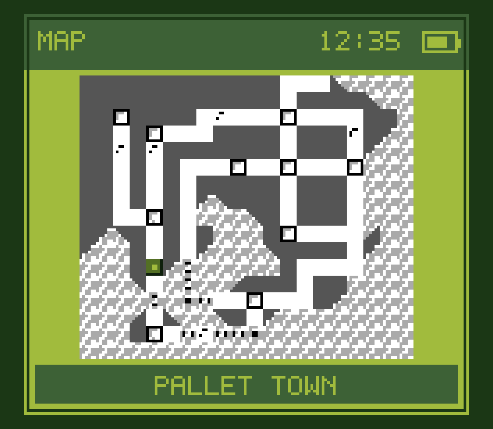

# Kanto Gear

Kanto Gear turns a supported dual-screen Android handheld into a Gen 1
companion: the game stays on the main display while maps, party information,
battles, menus and contextual touch controls move to the second display.

> [!IMPORTANT]
> This is an **unofficial Android public test build**, not an official
> Gen1Recomp release. It is verified on an **AYN Thor running Android 13** and
> community-tested on a **Retroid Pocket 5 with the Retroid Dual Screen Add-on**.
> Other handhelds, docks and HDMI setups still need community testing.

  
  

## What it does

- Shows a touchable Kanto map, party, step counter, field tools, area data and
  an optional guide on the second display.
- Moves battle choices, move learning, dialogue choices and PC lists to the
  second display when those screens are active.
- Can hide duplicated battle UI on the main display. On the tested Thor, the
  main UI returns immediately when the second display is switched off.
- Offers `AUTO`, `HANDHELD` and `EXTERNAL` display targeting for handheld,
  docked and TV-style layouts.
- Swaps the game and Kanto Gear between connected screens live with **Y** and
  returns the game to the remaining display if one screen is switched off or
  disconnected.
- Uses the host's detailed map tiles for clearer local maps, warns below 20%
  battery, and lets players hide Kanto Gear's own caught marker independently
  of other mods.
- Works without the Voxel Mod. The matching Voxel performance fork is an
  optional visual upgrade.

## Which downloads do I need?

Use this matched release set:

| Download | Required? | What it provides |
| --- | --- | --- |
| [`gen1recomp-android-0.1.75-kanto.5.apk`](https://github.com/AverageConsumer/gen1recomp/releases/tag/v0.1.75-kanto.5) | **Required** | Android host with the dual-display bridge, live screen swap and detailed-map interface |
| [`Kanto-Gear-Mod-1.4.0.zip`](https://github.com/AverageConsumer/kanto-gear/releases/tag/v1.4.0) | **Required** | Kanto Gear itself |
| [`DRAMATIC_SHAPE-1.6.2-android.1.zip`](https://github.com/AverageConsumer/DramaticShapeVoxelMod/releases/tag/v1.6.2-android.1) | Optional | Tested Android 3D renderer and Stadium compatibility fixes |

The official Gen1Recomp Android release does not yet contain the complete host
support used by Kanto Gear, so the APK fork is currently required. Kanto Gear
works without Dramatic Shape. If you already use or want Dramatic Shape on
Android, use the matching Voxel fork above: it contains companion-screen battle
HUD fixes that prevent empty gray or translucent panels from remaining on the
main display when Kanto Gear moves that HUD to the second screen.

## Install on Android

You need your own supported Pokemon Red, Blue or Yellow ROM. No ROM or
ROM-extracted game data is included here.

> [!IMPORTANT]
> Use the matched versions above. The host APK and Kanto Gear are required. The
> Voxel component is optional because Kanto Gear works without Dramatic Shape.
> If you use Dramatic Shape with Kanto Gear on Android, use the matching fork
> rather than another Voxel build. Do not substitute the official host or mix
> versions from different release sets.

1. Download `gen1recomp-android-0.1.75-kanto.5.apk` from the matching
   [Gen1Recomp Android test release](https://github.com/AverageConsumer/gen1recomp/releases/tag/v0.1.75-kanto.5)
   and install it.
2. Download `Kanto-Gear-Mod-1.4.0.zip` from the matching
   [Kanto Gear release](https://github.com/AverageConsumer/kanto-gear/releases/tag/v1.4.0).
3. Start **Gen1Recomp Android Test**, import your ROM, open the **MODS** tab,
   tap **Import mod .zip**, and choose `Kanto-Gear-Mod-1.4.0.zip`.
4. Make sure **Kanto Gear** is enabled, then start the game. The companion
   appears automatically when Android reports a suitable second display.

The Android test host is published by the Gen1Recomp fork, not by Kanto Gear.
It contains no bundled mods. Its own Android package installs beside the
official Gen1Recomp app and does not automatically reuse that app's ROM cache
or saves. Use Gen1Recomp's normal save export/import if you want to move a
playthrough.

Future APK updates from this fork keep the same package ID and signing key.
Install a newer APK over the existing **Gen1Recomp Android Test** app to retain
its app data, ROM cache, saves and settings. Do not uninstall the app when
updating, and keep an exported save backup while this remains test software.

Android may ask which app may install the downloaded APK. Grant that permission
only to the browser or file manager you used; disabling device-wide security
features is not required.

## Optional: Voxel performance fork (Android only)

Kanto Gear does not require the Voxel Mod. However, if you use Dramatic Shape
together with Kanto Gear on Android, use this matching fork so the moved battle
HUD is handled correctly. We love the original mod and recommend its official
release on PC. This fork belongs to the Android Kanto Gear package because
handhelds need additional frame-pacing and companion-screen compatibility work.
For the tested Android 3D setup:

1. Download the latest `.zip` from the
   [Kanto Gear Voxel performance fork](https://github.com/AverageConsumer/DramaticShapeVoxelMod/releases/tag/v1.6.2-android.1).
2. If the original Dramatic Shape Voxel Mod is already installed, remove it
   from the **MODS** tab first. Both versions intentionally use the same mod ID.
3. Import the performance-fork `.zip` through **MODS → Import mod .zip**.
   Confirm the experimental-mod warning and enable it.

A fresh setup starts at the tested Thor profile: **VOXEL 35**, **BALANCED**,
**T-SHIFT 3** and **V-CURVE OFF**. Existing saved choices are never replaced.

The fork is based on Dramatic Shape Voxel Mod 1.6.2. Its performance changes
are promising on the Thor, but they are not claimed to improve every GPU or
handheld and the fork is not distributed as a PC replacement.

## Using the lower screen

- **Swipe left or right** across the lower screen to move between the map,
  party, Trainer Card, field tools, area information and guide pages. The
  Trainer Card combines badges, money, play time, Pokédex progress and steps.
- **Tap the arrows in the header** for the same navigation without swiping.
  Horizontal swipes and arrows also move through multi-page Guide and Area
  views before continuing to the next section.
- **AREA MAP** defaults to **OFF**. **MAP** adds a swipe page showing
  the complete current map or floor and your live position; **ENHANCED** also
  marks exits plus visible and hidden items that have not been collected. The
  regular region map remains the Fly screen, so tapping its unlocked
  destinations still works as before. Tap **+ / -** on the local map to toggle
  a player-centred zoom.
- **Tap the visible buttons and list entries** to use touch controls.
- On **PARTY**, each Pokémon shows a thin EXP bar below its HP bar. Tap a card
  for **STATS** or **SWAP**. Stats opened there stay on the lower screen while
  the paused game remains visible above; swapping stays locked whenever the
  overworld is busy.
- Battles, menus, dialogue choices and other prompts automatically replace
  the normal page when they need input, then return to it afterward.

## Settings worth knowing

- **GEAR SCREEN → AUTO** is the recommended default.
- **HANDHELD** prefers the other built-in display.
- **EXTERNAL** prefers an external presentation display for TV-style use.
- Press **Y** while the companion is connected to swap the game and Kanto
  Gear between the two displays without restarting.
- **BATTLE VIEW → STANDARD** keeps the normal game HUD. **GEAR** moves
  duplicated battle controls to Kanto Gear, while **FULL GEAR** also moves the
  HP/status panels. The standard split layout remains the default.
- **INFO → PURIST** hides gameplay-assistance pages; **ENHANCED** enables them.
- **TRIGGER TABS** lets L2/R2 cycle Kanto Gear pages. It is off by default so
  other mods remain free to use those controls.

## Tested release set

| Component | Version | Role |
| --- | --- | --- |
| [Kanto Gear](https://github.com/AverageConsumer/kanto-gear) | 1.4.0 public test | Required second-screen mod |
| [Gen1Recomp Android test fork](https://github.com/AverageConsumer/gen1recomp) | 0.1.75-kanto.5 | Required Android host APK |
| [Dramatic Shape performance fork](https://github.com/AverageConsumer/DramaticShapeVoxelMod) | 1.6.2-android.1 | Optional Android 3D renderer |

Do not mix arbitrary releases from the three repositories. Each Kanto Gear
release links the exact set that was tested together.

Automatic updates are disabled for the forked host and both package mods so an
upstream release cannot silently replace one component. Install future Kanto
Gear release sets manually as a matched group.

## Known limits

- The AYN Thor is the confirmed reference device. Retroid Pocket 5 support was
  tested with Retroid's USB-C Dual Screen Add-on. Other Android dual-display
  hardware, including GammaOS devices, still needs community testing.
- Desktop and ordinary single-screen builds have no companion display; the mod
  stays inactive rather than opening another desktop window.
- External-monitor rotation, unusual three-display layouts and manufacturer
  Android changes need real-device reports.
- Fancy water with V-CURVE can fall back to ordinary animated water tiles on
  the Thor's Adreno GPU. That is in the upstream Voxel water path, not Kanto
  Gear.
- This is active playtest software. Keep a normal exported save backup.

## Reporting a problem

Open an issue in the repository that owns the problem:

- second display, touch or Kanto Gear UI → [Kanto Gear issues](https://github.com/AverageConsumer/kanto-gear/issues)
- app startup or host integration → [Gen1Recomp fork issues](https://github.com/AverageConsumer/gen1recomp/issues)
- 3D rendering or performance → [Voxel performance fork issues](https://github.com/AverageConsumer/DramaticShapeVoxelMod/issues)

Please include the device, Android version, display setup, installed versions,
what you expected, what happened, and a screenshot if possible. Do not report
fork-only problems to the upstream projects unless they reproduce there.

## Project family and credits

The repositories stay separate because they have different owners and release
cycles:

- **Kanto Gear** contains the second-screen mod, screenshots and main guide.
- The **Gen1Recomp fork** publishes the separate Android test host APK.
- The **Dramatic Shape fork** publishes the optional Android renderer mod.

Kanto Gear is built on [Gen1Recomp](https://github.com/bryanthaboi/gen1recomp).
The optional renderer is built on
[Dramatic Shape Voxel Mod](https://github.com/DramaticShape/DramaticShapeVoxelMod).
Their progress, code and project direction remain theirs. These forks exist to
test additional work without presenting it as official or asking upstream
users to debug our changes.

Special thanks to [@Rocky5150](https://github.com/Rocky5150) for patiently
testing the Retroid Pocket 5 dual-screen support, collecting detailed
diagnostics, and working with us for more than 24 hours to identify and verify
the Android display-routing fixes.

The optional Modern Light and Modern Dark themes adapt the angular panels,
dark surfaces, and red-and-blue accents shared by
[CustCast's Thor UI work](https://github.com/CustCast/PokeRogue-App-Android-Thor).
Thanks to CustCast for making the original artwork available and inviting its
use in Kanto Gear.

Kanto Gear's own code is available under the [MIT License](LICENSE). That
license does not replace or extend the licenses, rights or ownership of
Gen1Recomp, Dramatic Shape Voxel Mod, Pokemon or their respective assets.

Pokemon and related names are trademarks of their respective owners. This
project is not affiliated with Nintendo, Game Freak, The Pokemon Company,
Gen1Recomp or DramaticShape.
