

# Kanto Gear

### A second screen when you have one. A better layout when you do not.

Kanto Gear is a single- and dual-screen companion UI for Pokémon Red, Blue,
Yellow, Gold, Silver and Crystal in
[Gen1Recomp](https://github.com/bryanthaboi/gen1recomp). It adds live maps,
party and Pokédex data, battle controls and touch-friendly tools on Android,
Windows and Linux—without requiring a custom host or 3D renderer.

  
  
  
  
  

  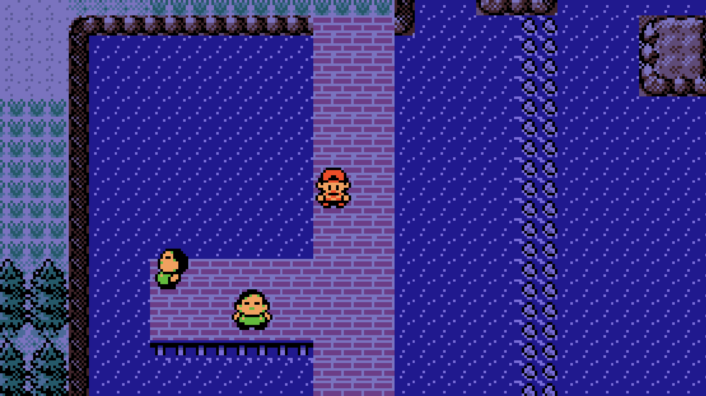
  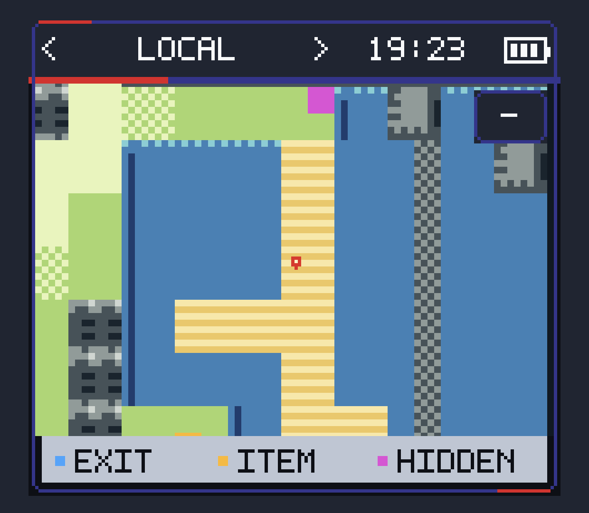

  <strong><a href="https://bryanthaboi.github.io/gen1recomp-mod-index/">Install from the official Mod Index</a></strong>
  · <strong><a href="https://github.com/AverageConsumer/kanto-gear/releases/latest">Download ZIP</a></strong>
  · <strong><a href="#install">Setup</a></strong>
  · <strong><a href="https://github.com/AverageConsumer/kanto-gear/issues">Report a problem</a></strong>

## More than a second map

Kanto Gear follows the game and turns otherwise unused screen space into a
companion interface. Assistance is optional: **Purist** keeps the experience
close to the original games, while **Enhanced** exposes useful information the
game already knows.

| Explore | Manage | Battle | Adapt |
| --- | --- | --- | --- |
| Region map, live Explorer, encounters, trainers and items | Party, Bag, Pokédex, Trainer Card, tools and step counter | Standard HUD, touch controls, Full Gear HUD and optional Enemy Info | Customizable Home, single screen, combined layouts and independent second displays |

| Party at a glance | Know the opponent | Find what lives here |
| --- | --- | --- |
| 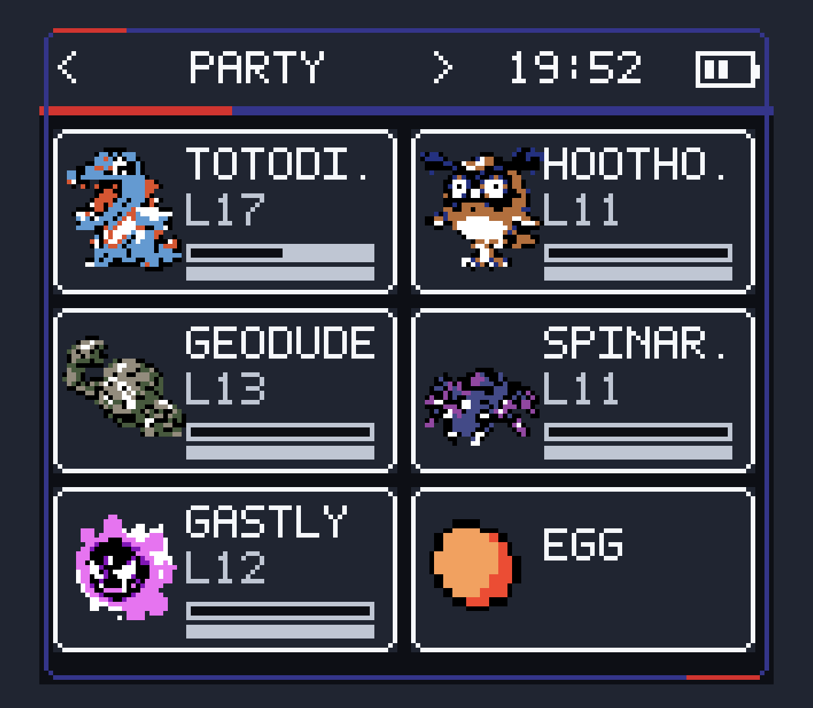 | 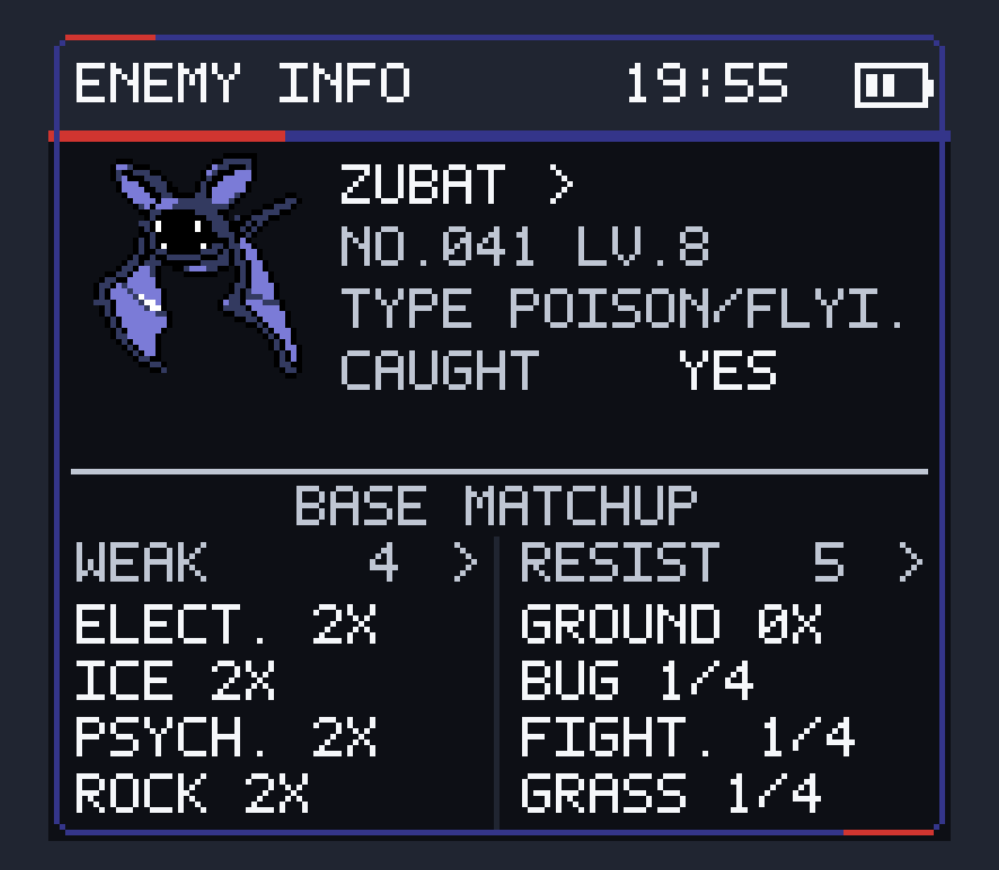 | 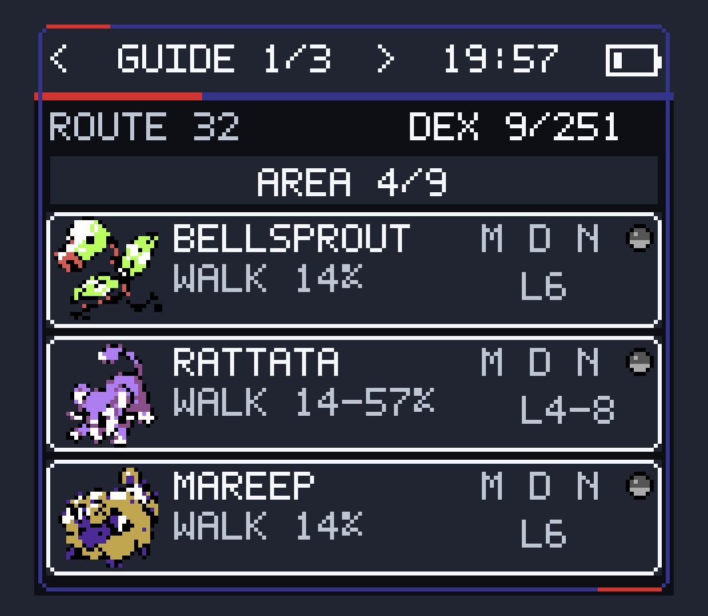 |
| Native-color sprites, HP, EXP, status and Eggs without revealing what will hatch. | Optional Pokédex identity and base type matchups while the original battle UI stays intact. | Encounter rates, levels, caught state and morning, day or night availability. |

Kanto Gear uses native game palettes where the host exposes them, keeps unknown
Pokémon as silhouettes and renders LOCAL terrain with consistent cartographic
colors. The interface supports classic Game Boy-inspired themes, Modern Light
and Modern Dark, plus the new high-resolution HGSS Light and HGSS Dark themes.

## Kanto Gear 3.0: Silph Link

HGSS Light and HGSS Dark turn the companion screen into a touch-first Silph
Link instead of repainting the older tab bar. Its Home screen can span any
number of pages and mix app icons with live widgets. Long-press a card to enter
Edit mode, swap cards or move them to another page, and use **Silph Store** to
choose which optional apps and widgets are available. Store installs are local
Kanto Gear preferences; no code or network download occurs.

  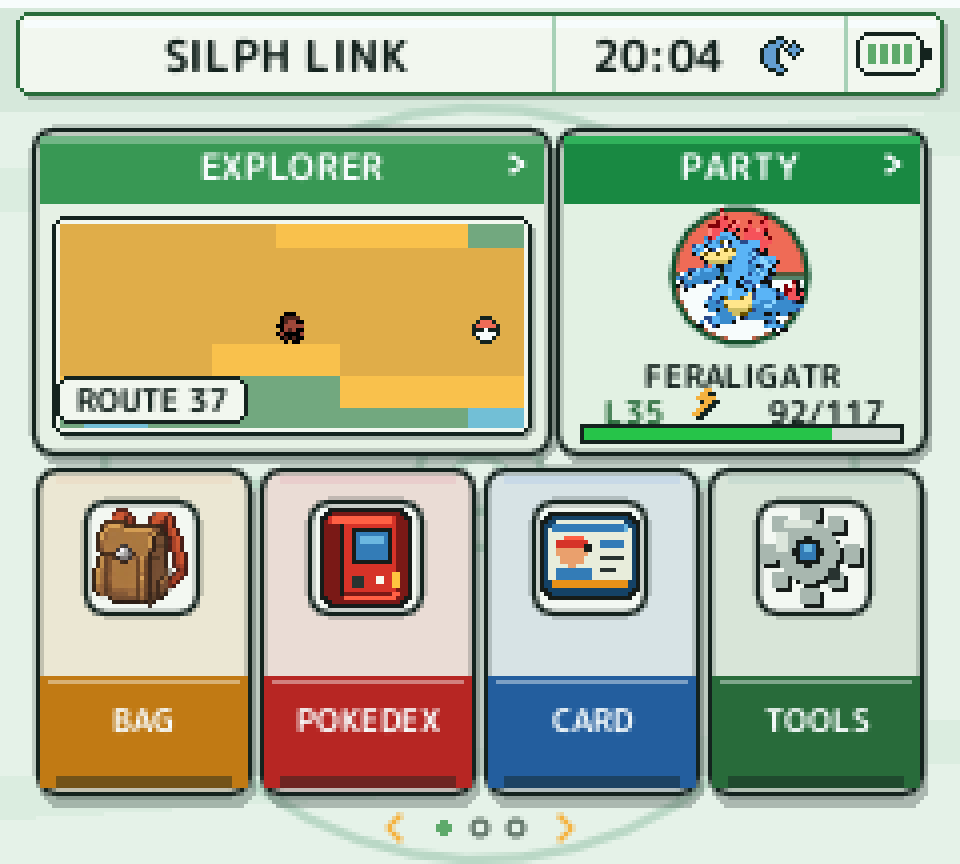
  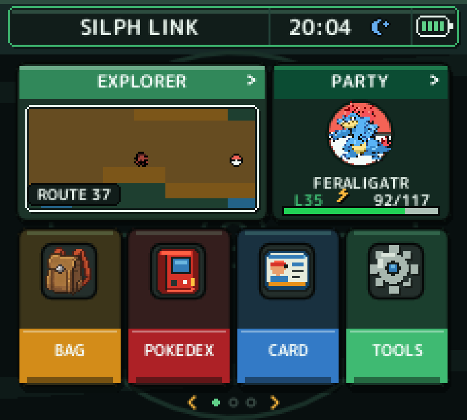

Explorer combines a live tile map with encounters, trainers, visible items and
Itemfinder behavior. Party, Bag, Pokédex, Trainer Card, Map, Step Counter and
Field Kit each have a dedicated bottom-screen app. Battle menus, contextual
Party pickers, move learning, move details and PC storage use the same visual
and touch language without replacing the original game logic.

  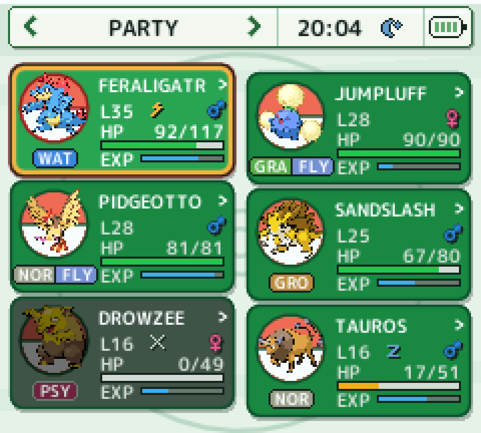
  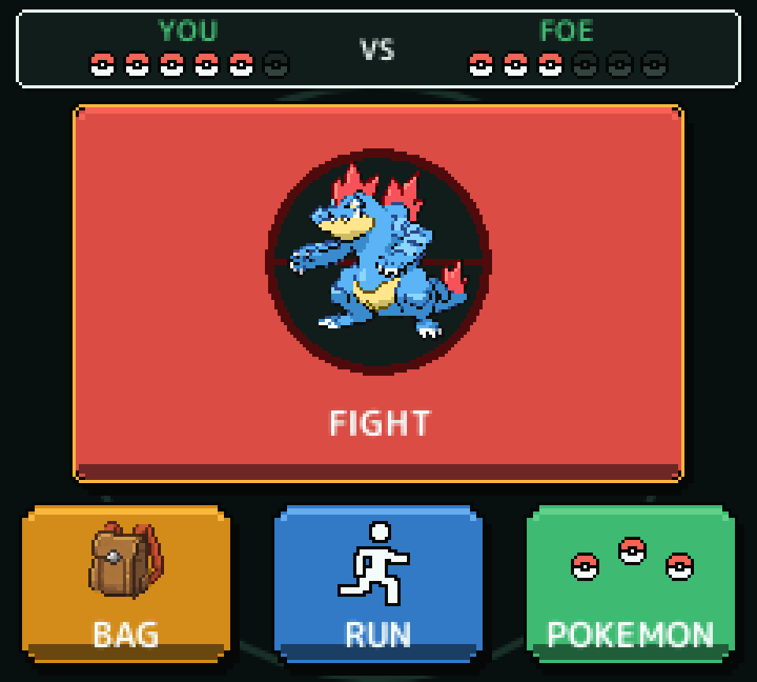

Version 3.0 does not force the new theme. Existing theme, display and gameplay
settings remain in place, and every pre-3.0 Kanto Gear theme remains available.

## One mod, three display modes

| Display mode | Best for | Behavior |
| --- | --- | --- |
| **Fullscreen Swap** | Phones and small one-screen handhelds | Keeps one view fullscreen and swaps between the game and Kanto Gear on demand. |
| **Combined Screen** | Steam Deck-style devices, tablets and larger displays | Places both views side by side, stacked or in a movable, resizable overlay. |
| **Separate Screens** | AYN Thor, RG DS, Retroid add-ons, desktops and multi-monitor setups | Routes Kanto Gear to a selected Android display or opens a normal movable desktop window. |

  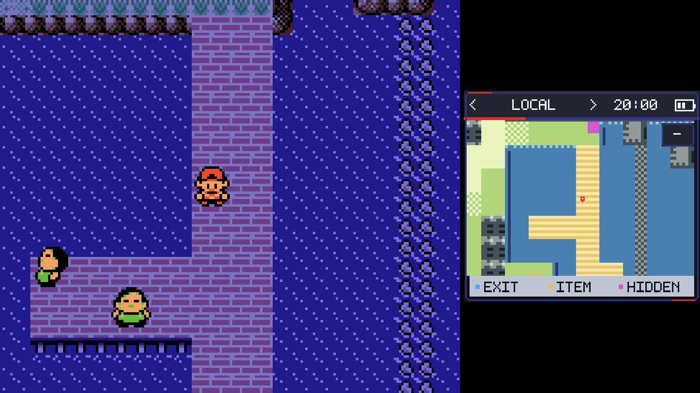
  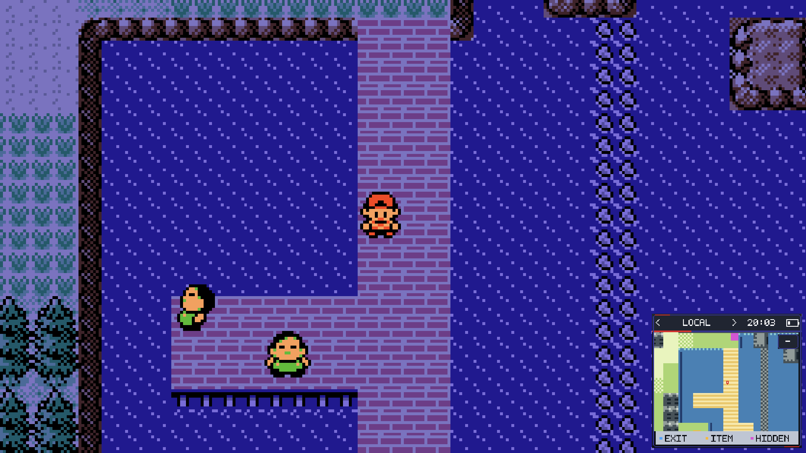

The game viewport and Android touch controls adapt when a combined layout makes
the main view smaller. Display changes and disconnects are handled live so the
game remains reachable when a second display disappears.

## Install

Kanto Gear works with the **official Gen1Recomp host**. New installations do
not need the former Kanto host or any Voxel renderer.

1. Install the [latest official Gen1Recomp release](https://github.com/bryanthaboi/gen1recomp/releases/latest)
   for your platform.
2. Open Gen1Recomp's **MODS** screen and install **Kanto Gear** from the official
   Mod Index, or import `kanto_gear-*.zip` from the
   [latest Kanto Gear release](https://github.com/AverageConsumer/kanto-gear/releases/latest).
3. Enable Kanto Gear and start Pokémon Red, Blue, Yellow, Gold or Silver.
4. Open Kanto Gear's settings and choose **Fullscreen Swap**,
   **Combined Screen** or **Separate Screens**.

You need your own supported game ROM. Kanto Gear contains no ROM, ROM-derived
game data or save file.

Optional German, Spanish (Spain) and French interface packs are attached to
every release. Import one only if you want that language. Other translations
can use the small [language-pack template](translations/README.md).

## Games and host requirements

| Game | Kanto Gear support | Minimum official host |
| --- | --- | --- |
| Pokémon Red, Blue and Yellow | Full Gen 1 companion UI | Gen1Recomp 0.1.99 |
| Pokémon Gold | Full Gen 2 companion UI | Gen1Recomp 0.1.99 |
| Pokémon Silver | Full Gen 2 companion UI | Gen1Recomp 0.2.10 |
| Pokémon Crystal | Full Gen 2 companion UI | Gen1Recomp 0.2.22 |

The legacy Android host `0.1.94-kanto.22` remains accepted only as a temporary
save-migration bridge. Current users should use the official host.

<strong>Migrating from the former Kanto host</strong>

The legacy and official Android hosts use separate app identities. The official
app therefore installs beside the old host and cannot automatically see its
private saves or installed mods.

Export your save from the old host, then import the ROM, save and Kanto Gear
into the official app. Do not remove the old host until the migrated save has
been verified. Gen1Recomp cannot currently export Pokémon Gold or Silver
cartridge `.sav` files, so Gen 2 players should keep the legacy host installed
until an upstream transfer path is available.

## Platform and device support

| Platform or device | Status |
| --- | --- |
| **AYN Thor** | Primary development and test device; dual screen, touch and live display changes tested. |
| **Retroid Pocket 5 + Dual Screen Add-on** | Community tested with automatic external-display routing. |
| **Anbernic RG DS + GammaOS Nano 1.4 (Android 14)** | Community confirmed; avoid stacking multiple performance-heavy mods on this lower-power hardware. |
| **Anbernic RG DS + Rocknix** | Dual-screen and touch routing community confirmed with the diagnostic PortMaster build; current-package confirmation is still welcome. |
| **Windows 11** | Combined layouts and a separate movable companion window tested. |
| **Linux x86_64 and ARM64** | Packages use the same desktop-window path; real-device reports remain welcome. |
| **Steam Deck-style one-screen devices** | Single Screen and Combined Screen layouts are designed for this use case. |
| **External Android displays, docks and TVs** | Supported through selectable display routing. |

macOS can run the universal `.love` package through the same desktop display
path, but Kanto Gear does not currently ship or claim a tested signed macOS app
bundle.

## Controls and useful settings

| Action | Control |
| --- | --- |
| Change Kanto Gear page | Swipe left/right or tap the header arrows |
| Edit the HGSS Home screen | Long-press an app or widget, then swap it with another card or a free slot |
| Add an HGSS Home item | Enter Edit mode and tap a free `+` slot |
| Swap the two views | Enable **QUICK SWAP (Y)**, then press **Y** |
| Cycle pages with a controller | Enable **TRIGGER TABS**, then use **L2/R2** |
| Hide or show the Combined Screen overlay | Press **R3** |
| Zoom the local map | Tap **+ / −** |
| Open settings with Modern UI | **MOD MENUS → KANTO GEAR** |

<strong>Battle and information modes</strong>

- **BATTLE VIEW → STANDARD** keeps the original battle HUD.
- **BATTLE VIEW → GEAR** moves duplicated battle controls to Kanto Gear.
- **BATTLE VIEW → FULL GEAR** also moves HP and status panels.
- **BATTLE VIEW → INFO** keeps the original HUD and shows known opponent
  data on the companion screen.
- **INFO → PURIST** hides assistance; **ENHANCED** enables it.
- **SCREEN SWAP (Y)** is off by default so other mods can keep using **Y**.

## Compatibility and support

Kanto Gear validates the data contract of game screens before mirroring or
taking them over. If another UI mod replaces a menu with an incompatible model,
Kanto Gear falls back instead of drawing mismatched controls or crashing. These
checks are generic; the project does not maintain per-mod compatibility hacks.

Kanto Gear does not require or bundle a Voxel renderer. The former
[Dramatic Shape Android fork](https://github.com/AverageConsumer/DramaticShapeVoxelMod)
is frozen at `1.7.0-android.1` and unsupported. Other renderer forks may work,
but compatibility exclusive to those projects belongs to their current
maintainers. Do not install multiple Dramatic Shape variants together because
they intentionally share a mod ID.

For Kanto Gear display, touch or companion-UI problems, open an
[issue](https://github.com/AverageConsumer/kanto-gear/issues) and include:

- device and operating system;
- official host and Kanto Gear versions;
- display mode and physical display setup;
- installed mods and versions;
- a screenshot showing both views, when useful.

General startup and host problems belong to the
[Gen1Recomp issue tracker](https://github.com/bryanthaboi/gen1recomp/issues).

## Credits and license

Kanto Gear is built on [Gen1Recomp](https://github.com/bryanthaboi/gen1recomp)
and released under the [MIT License](LICENSE).

Special thanks to [@Rocky5150](https://github.com/Rocky5150) for extensive
Retroid Pocket 5 testing and diagnostics, and to
[CustCast](https://github.com/CustCast/PokeRogue-App-Android-Thor) for sharing
the artwork that inspired the optional Modern Light and Modern Dark themes.
The Spanish (Spain) translation was contributed by **Desierto La Espada**.
The French translation was contributed by **Blastheaven2**.

Pokémon and related names are trademarks of their respective owners. This is a
fan project and is not affiliated with Nintendo, Game Freak, The Pokémon
Company, Gen1Recomp or Dramatic Shape.
