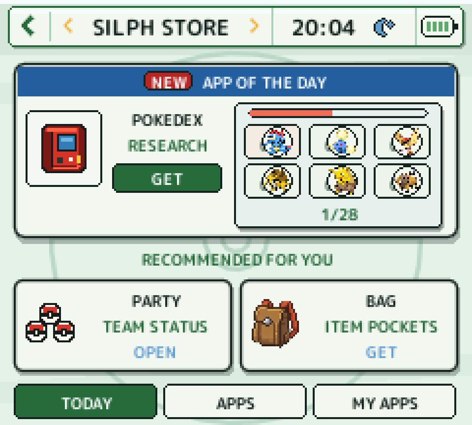

# Kanto Gear 3.1

### Silph Link OS — Your adventure. Reconnected.

A Nintendo DS-inspired companion OS for Pokémon Red, Blue, Yellow, Gold,
Silver and Crystal in [Gen1Recomp](https://github.com/bryanthaboi/gen1recomp).

  
  
  
  

  
  

  <strong><a href="https://bryanthaboi.github.io/gen1recomp-mod-index/">Install from Mod Index</a></strong>
  · <strong><a href="https://github.com/AverageConsumer/kanto-gear/releases/latest">Download ZIP</a></strong>
  · <strong><a href="https://github.com/AverageConsumer/kanto-gear/issues">Report a problem</a></strong>

## Silph Link OS

Kanto Gear turns otherwise unused screen space into a live companion system.
Version 3 replaces the old fixed tab bar with a customizable Home screen built
from apps, shortcuts and widgets.

- **Explorer** combines the local map, current encounters, trainers, items and
  Itemfinder behavior without reducing the adventure to a spreadsheet.
- **Party, Bag, Pokédex, Map, Trainer Card and Field Kit** are dedicated
  bottom-screen apps with contextual touch flows.
- **Silph Store** explains and manages optional apps and widgets. Everything
  already ships inside Kanto Gear; the Store never downloads executable code.
- **Achievements** collects exploration stamps and helps track area progress.
  Install it from Silph Store; it respects your research mode.
- **Team View** puts all six party members on Home, with a tap into their details.
- **HGSS Light, Dark and Auto** provide the new high-resolution visual system.
  Auto follows Gen 2 night and uses the same 18:00 boundary in Gen 1.
- **Vanilla, Enhanced and Spoilers** let each player choose how much assistance
  Explorer and the battle interface reveal.
- Redesigned battle menus, Party selection, move learning, item use and PC
  storage still execute the original game actions and rules.

  
  

Long-press an app or widget to edit Home, then swap it with another compatible
card or an empty slot. Layout, installed apps, widgets and settings persist
across restarts. Legacy Kanto Gear themes remain available, but every 3.0
installation starts once in HGSS Light so Silph Link OS cannot be missed.

## Install

1. Install the [latest official Gen1Recomp release](https://github.com/bryanthaboi/gen1recomp/releases/latest)
   for your platform.
2. Install **Kanto Gear** from the official Mod Index, or import
   `kanto_gear-*.zip` from the [latest release](https://github.com/AverageConsumer/kanto-gear/releases/latest).
3. Enable Kanto Gear, start a supported game and select your display mode in
   the fixed **Options** app.

You need your own supported ROM. Kanto Gear contains no ROM, ROM-derived game
data or save file. English, German, Spanish (Spain) and French are built in under
**Settings → Appearance → Language**. Disable the old companion language packs;
they are no longer needed. Only Kanto Gear's interface changes language; game
text remains untouched.
See [language support](translations/README.md).

## Display modes

| Mode | Best for |
| --- | --- |
| **Fullscreen Swap** | Phones and small one-screen handhelds |
| **Combined Screen** | Steam Deck-style devices, tablets and large displays; optional bottom safe area for Android touch controls |
| **Separate Screens** | AYN Thor, RG DS, desktop windows and multi-monitor setups |

Swipe or use visible arrows inside paged Silph Link apps. Optional **Trigger
Tabs** use L2/R2 where supported, while Home editing intentionally remains
touch-only. Android touch-control positions belong to the host; use its
**Touch Controls** editor if they overlap a combined layout.
Combined Screen can also reserve a configurable **Bottom Safe Area** so the
complete game and companion layout stays above fixed Android controls.

## Compatibility

| Game | Minimum official host |
| --- | --- |
| Pokémon Red, Blue and Yellow | Gen1Recomp 0.1.99 |
| Pokémon Gold | Gen1Recomp 0.1.99 |
| Pokémon Silver | Gen1Recomp 0.2.10 |
| Pokémon Crystal | Gen1Recomp 0.2.22 |

Android, Windows and Linux use the same Kanto Gear mod ZIP. The AYN Thor is the
primary development device; combined layouts, independent displays and the
desktop companion window are also supported.

<strong>Moving from the former Kanto Android host</strong>

The legacy and official Android hosts use separate app identities. Export your
save from the old host, then import the ROM, save and Kanto Gear into the
official app. Keep the old host until the migrated save has been verified.
Gen1Recomp cannot currently export Gold or Silver cartridge `.sav` files, so
those players should retain the legacy installation until an upstream transfer
path exists.

## Support

For Kanto Gear display, touch or companion-UI problems, open an
[issue](https://github.com/AverageConsumer/kanto-gear/issues) with your device,
operating system, host version, Kanto Gear version, display mode and installed
mods. General startup and host problems belong to the
[Gen1Recomp issue tracker](https://github.com/bryanthaboi/gen1recomp/issues).

## Credits

Kanto Gear is built on [Gen1Recomp](https://github.com/bryanthaboi/gen1recomp)
and released under the [MIT License](LICENSE). Spanish was contributed by
**Desierto La Espada** and French by **Blastheaven2**. Special thanks to
[@Rocky5150](https://github.com/Rocky5150) for extensive device testing.

Pokémon and related names are trademarks of their respective owners. This fan
project is not affiliated with Nintendo, Game Freak, The Pokémon Company or
Gen1Recomp.
