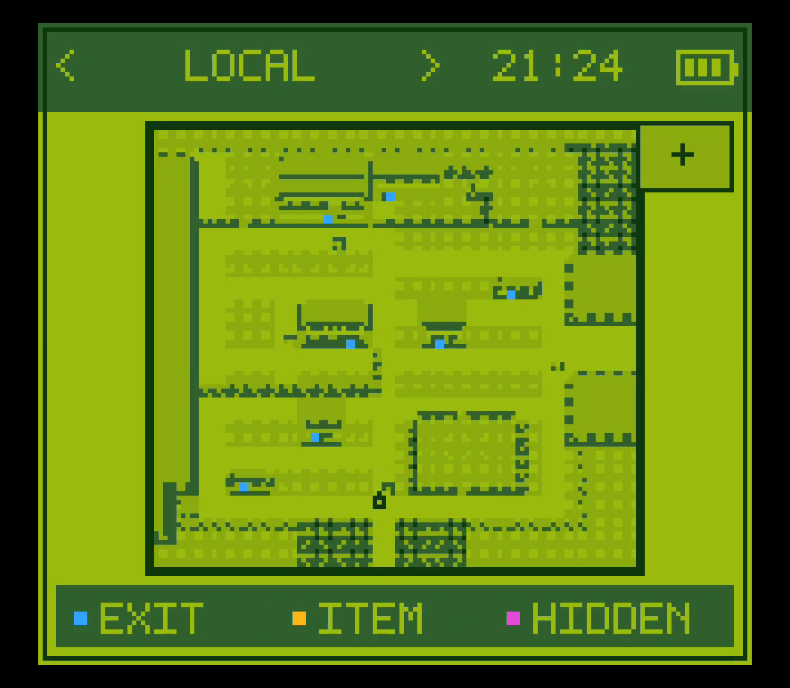
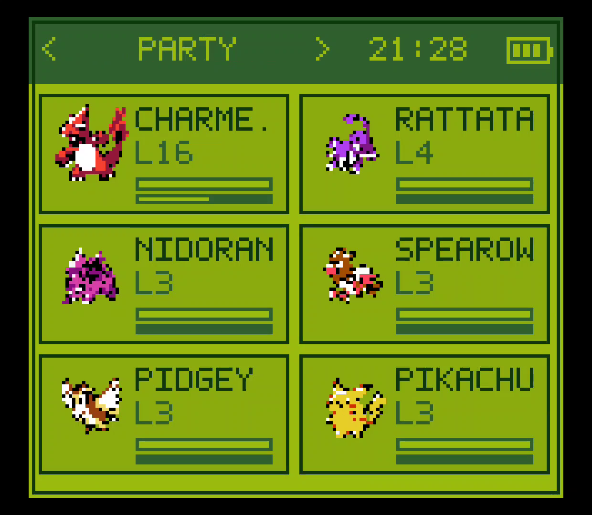
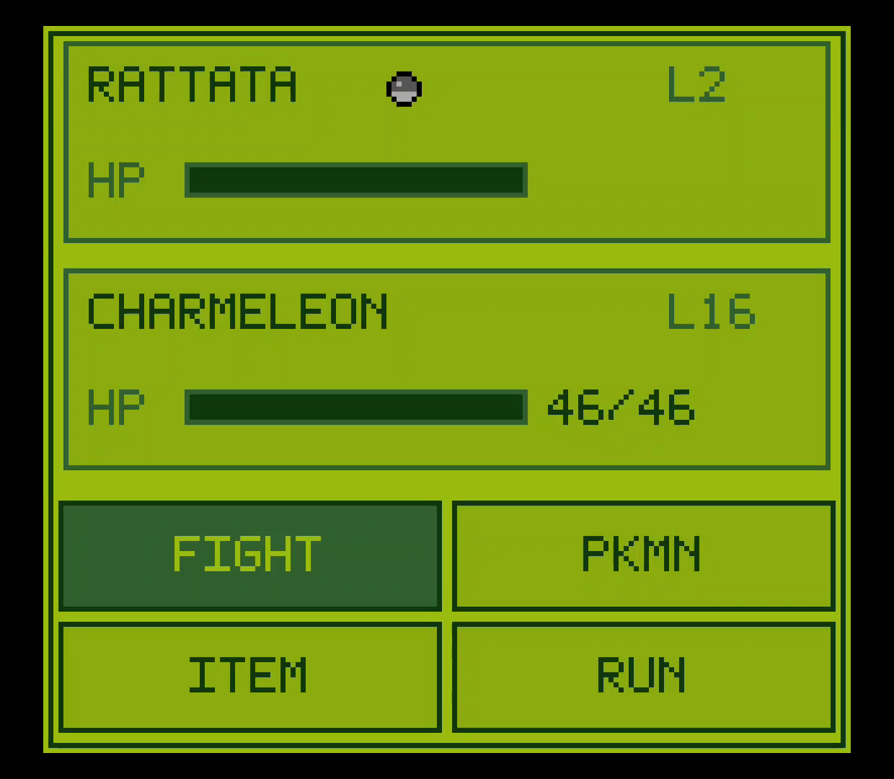

# Kanto Gear

### A Nintendo DS-style second screen for Pokémon Red, Blue and Yellow

Turn a dual-screen Android handheld into a complete Gen 1 companion for [Gen1Recomp](https://github.com/bryanthaboi/gen1recomp): keep the game on one display and put maps, party data, battles and touch controls on the other.

  
  
  

  
  
  

<strong><a href="https://github.com/AverageConsumer/kanto-gear/releases/tag/v1.7.0">Download Kanto Gear</a></strong> · <strong><a href="#install-on-android">Install on Android</a></strong> · <strong><a href="https://github.com/AverageConsumer/kanto-gear/issues">Report a problem</a></strong>

## Your adventure, always in reach

Kanto Gear gives Pokémon Red, Blue and Yellow a dedicated companion display
without changing the game underneath it.

- Explore with a live region map, detailed local maps, exits and item markers.
- Check your party, Trainer Card, badges, Pokédex progress, steps and area data.
- Use contextual touch controls for battles, bags, dialogue, PC boxes and moves.
- Move battle controls—or the complete battle HUD—to the second screen.
- Swap the game and Kanto Gear between displays instantly with **Y**.
- Choose classic Game Boy-inspired or modern light and dark themes.

The normal game UI returns when the second display is switched off or
disconnected, so you are never trapped on a missing screen.

## What you need

Kanto Gear currently uses a matched Android release set. The Voxel renderer is
optional; the host and Kanto Gear mod are required.

| Download | Required | Purpose |
| --- | :---: | --- |
| [Gen1Recomp Android Test 0.1.75-kanto.6](https://github.com/AverageConsumer/gen1recomp/releases/tag/v0.1.75-kanto.6) | **Yes** | Android host with the dual-display bridge |
| [Kanto Gear 1.7.0](https://github.com/AverageConsumer/kanto-gear/releases/tag/v1.7.0) | **Yes** | The second-screen companion mod |
| [Dramatic Shape 1.7.0-android.1](https://github.com/AverageConsumer/DramaticShapeVoxelMod/releases/tag/v1.7.0-android.1) | No | Tested optional 3D renderer for Android |

> [!IMPORTANT]
> Use the versions linked above together. The official Gen1Recomp Android app
> does not yet contain every host feature required by this Kanto Gear release.

## Install on Android

You need your own supported Pokémon Red, Blue or Yellow ROM. No ROM or
ROM-extracted game data is included.

1. Install the [Gen1Recomp Android Test APK](https://github.com/AverageConsumer/gen1recomp/releases/tag/v0.1.75-kanto.6).
2. Download [Kanto Gear 1.7.0](https://github.com/AverageConsumer/kanto-gear/releases/tag/v1.7.0).
3. Open **Gen1Recomp Android Test → MODS → Import mod .zip** and select the
   Kanto Gear ZIP.
4. Enable **Kanto Gear** and start the game. The companion opens automatically
   when Android reports a suitable second display.

When updating the host, install the newer APK over the existing app. Do not
uninstall it first unless you have exported your save.

### Optional Voxel renderer

Kanto Gear works without a Voxel Mod. If you already use Dramatic Shape on
Android, use the [matching Kanto Gear fork](https://github.com/AverageConsumer/DramaticShapeVoxelMod/releases/tag/v1.7.0-android.1).
It contains companion-screen battle fixes that prevent empty panels and
duplicated HUD elements. Remove another Dramatic Shape build before importing
this one; both intentionally share the same mod ID.

## Made for real dual-screen hardware

### Supported devices

- **AYN Thor** — primary development and test device
- **Retroid Pocket 5 + Retroid Dual Screen Add-on** — community tested
- **External Android displays, docks and TVs** — supported through selectable
  `AUTO`, `HANDHELD` and `EXTERNAL` display routing; hardware reports are welcome

On single-screen and desktop builds, Kanto Gear stays inactive instead of
opening an unwanted extra window.

## Quick controls

| Action | Control |
| --- | --- |
| Change Kanto Gear page | Swipe left/right or tap the header arrows |
| Swap the two displays | Press **Y** |
| Cycle pages with a controller | Enable **TRIGGER TABS**, then use L2/R2 |
| Zoom the local map | Tap **+ / −** |
| Open Kanto Gear settings with Modern UI | **MOD MENUS → KANTO GEAR** |

Useful settings:

- **GEAR SCREEN → AUTO** is the recommended display mode.
- **BATTLE VIEW → STANDARD** keeps the original battle HUD.
- **BATTLE VIEW → GEAR** moves duplicated battle controls.
- **BATTLE VIEW → FULL GEAR** also moves HP and status panels.
- **INFO → PURIST** hides assistance; **ENHANCED** enables it.

## Compatibility and support

This is an unofficial Android public test build. It is not an official
Gen1Recomp release. Keep an exported save backup while testing.

Open a [Kanto Gear issue](https://github.com/AverageConsumer/kanto-gear/issues)
for second-display, touch or companion-UI problems. Include your device,
Android version, display setup, installed versions and a screenshot if useful.

Host startup problems belong to the
[Gen1Recomp Android fork](https://github.com/AverageConsumer/gen1recomp/issues).
Problems exclusive to the optional 3D renderer belong to the
[Dramatic Shape Android fork](https://github.com/AverageConsumer/DramaticShapeVoxelMod/issues).

## Credits

Kanto Gear is built on [Gen1Recomp](https://github.com/bryanthaboi/gen1recomp).
The optional renderer is based on
[Dramatic Shape Voxel Mod](https://github.com/DramaticShape/DramaticShapeVoxelMod).

Special thanks to [@Rocky5150](https://github.com/Rocky5150) for more than 24
hours of Retroid Pocket 5 testing and diagnostics, and to
[CustCast](https://github.com/CustCast/PokeRogue-App-Android-Thor) for sharing
the artwork that inspired the optional Modern Light and Modern Dark themes.

Kanto Gear's code is available under the [MIT License](LICENSE). Pokémon and
related names are trademarks of their respective owners. This project is not
affiliated with Nintendo, Game Freak, The Pokémon Company, Gen1Recomp or
Dramatic Shape.
