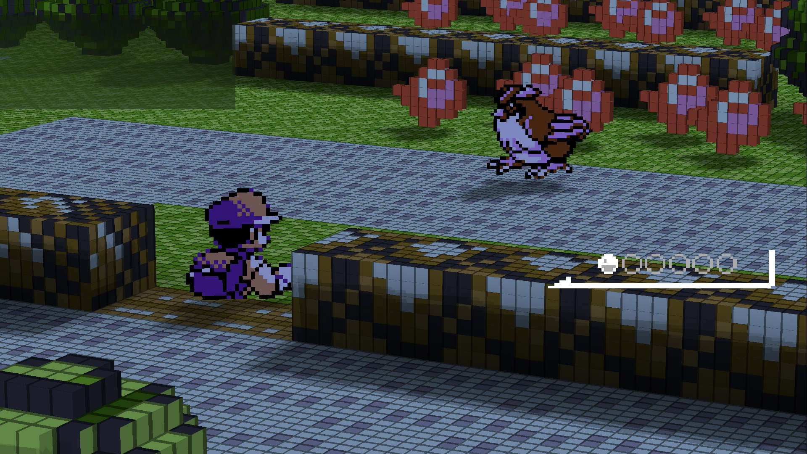
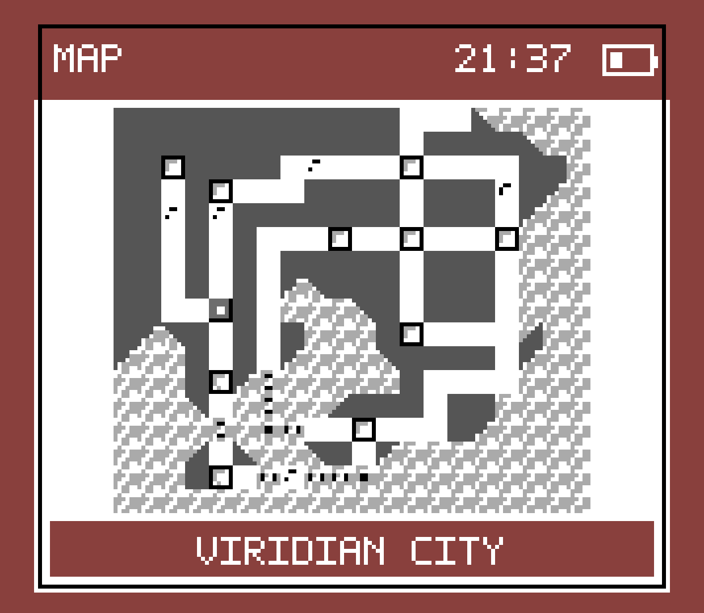
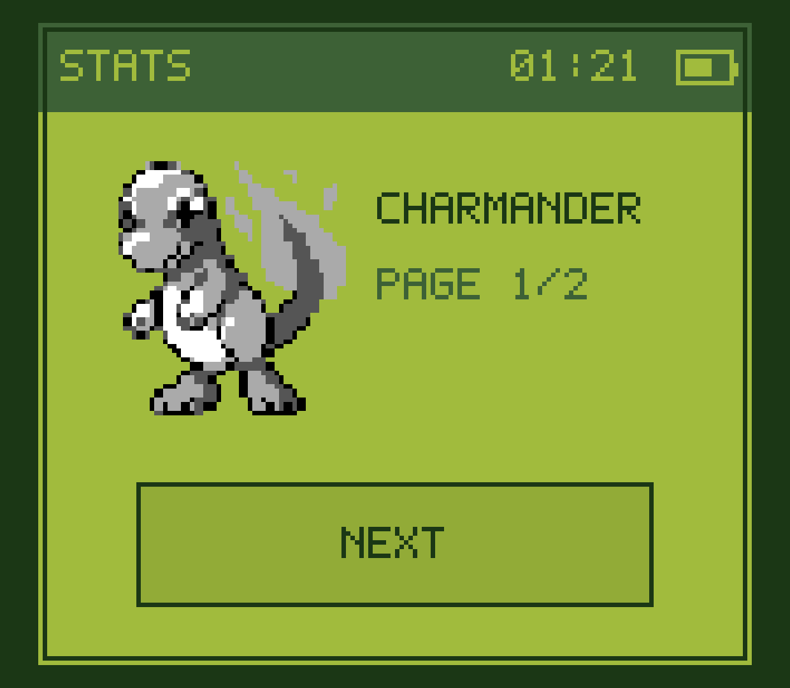

# Kanto Gear

Kanto Gear turns a supported dual-screen Android handheld into a Gen 1
companion: the game stays on the main display while maps, party information,
battles, menus and contextual touch controls move to the second display.

> [!IMPORTANT]
> This is an **unofficial public test build**, not an official Gen1Recomp
> release. It is currently tested on an **AYN Thor running Android 13**.
> Other Android dual-display devices, docks and HDMI setups need community
> testing.

  
  

## What it does

- Shows a touchable Kanto map, party, step counter, field tools, area data and
  an optional guide on the second display.
- Moves battle choices, move learning, dialogue choices and PC lists to the
  second display when those screens are active.
- Can hide duplicated battle UI on the main display. On the tested Thor, the
  main UI returns immediately when the second display is switched off.
- Offers `AUTO`, `HANDHELD` and `EXTRA SCREEN` display targeting for handheld,
  docked and TV-style layouts.
- Works without the Voxel Mod. The matching Voxel performance fork is an
  optional visual upgrade.

## Install on Android

You need your own supported Pokemon Red, Blue or Yellow ROM. No ROM or
ROM-extracted game data is included here.

1. Open the latest [Kanto Gear release](https://github.com/AverageConsumer/kanto-gear/releases/latest)
   and download `Kanto-Gear-1.0.0.apk` and
   `Kanto-Gear-Mod-1.0.0.zip`.
2. Install the APK. Then start **Kanto Gear**, import your ROM, open the
   **MODS** tab, tap
   **Import mod .zip**, and choose `Kanto-Gear-Mod-1.0.0.zip` from the same
   release.
3. Make sure **Kanto Gear** is enabled, then start the game. The companion
   appears automatically when Android reports a suitable second display.

The APK uses its own Android package and installs beside the official
Gen1Recomp app. It does not automatically reuse that app's ROM cache or saves.
Use Gen1Recomp's normal save export/import if you want to move a playthrough.

Android may ask which app may install the downloaded APK. Grant that permission
only to the browser or file manager you used; disabling device-wide security
features is not required.

## Optional: Voxel performance fork (Android only)

Kanto Gear does not require the Voxel Mod. We love the original mod and
recommend its official release on PC. This fork belongs to the Android Kanto
Gear package because handhelds need additional frame-pacing work. If you want
the tested Android 3D setup:

1. Download the latest `.zip` from the
   [Kanto Gear Voxel performance fork](https://github.com/AverageConsumer/DramaticShapeVoxelMod/releases/latest).
2. If the original Dramatic Shape Voxel Mod is already installed, remove it
   from the **MODS** tab first. Both versions intentionally use the same mod ID.
3. Import the performance-fork `.zip` through **MODS → Import mod .zip**.

The fork is based on Dramatic Shape Voxel Mod 1.5.2. Its performance changes
are promising on the Thor, but they are not claimed to improve every GPU or
handheld and the fork is not distributed as a PC replacement.

## Settings worth knowing

- **BOTTOM SCREEN → AUTO** is the recommended default.
- **HANDHELD** prefers the other built-in display.
- **EXTRA SCREEN** prefers an external presentation display for TV-style use.
- **HIDE UPPER BATTLE UI** removes duplicated battle menus only while the
  companion display is ready.
- **PROFILE → PURIST** hides gameplay-assistance pages; **ENHANCED** enables
  them; **CUSTOM** lets you choose each assist separately.

Swipe horizontally on the lower display to change normal pages. Menus, battles
and prompts temporarily take over that display when the game needs them.

## Tested release set

| Component | Version | Role |
| --- | --- | --- |
| [Kanto Gear](https://github.com/AverageConsumer/kanto-gear) | 1.0.0 public test | Product and second-screen mod |
| [Gen1Recomp Kanto Gear fork](https://github.com/AverageConsumer/gen1recomp) | based on 0.1.59 | Required Android host |
| [Dramatic Shape performance fork](https://github.com/AverageConsumer/DramaticShapeVoxelMod) | 1.5.3 public test | Optional Android 3D renderer; based on 1.5.2 |

Do not mix arbitrary releases from the three repositories. Each Kanto Gear
release links the exact set that was tested together.

## Known limits

- Hardware support outside the AYN Thor is currently unverified.
- Desktop and ordinary single-screen builds have no companion display; the mod
  stays inactive rather than opening another desktop window.
- External-monitor rotation, unusual three-display layouts and manufacturer
  Android changes need real-device reports.
- Fancy water with V-CURVE can fall back to ordinary animated water tiles on
  the Thor's Adreno GPU. That is in the upstream Voxel water path, not Kanto
  Gear.
- This is active playtest software. Keep a normal exported save backup.

## Reporting a problem

Open an issue in the repository that owns the problem:

- second display, touch or Kanto Gear UI → [Kanto Gear issues](https://github.com/AverageConsumer/kanto-gear/issues)
- app startup or host integration → [Gen1Recomp fork issues](https://github.com/AverageConsumer/gen1recomp/issues)
- 3D rendering or performance → [Voxel performance fork issues](https://github.com/AverageConsumer/DramaticShapeVoxelMod/issues)

Please include the device, Android version, display setup, installed versions,
what you expected, what happened, and a screenshot if possible. Do not report
fork-only problems to the upstream projects unless they reproduce there.

## Project family and credits

The repositories stay separate because they have different owners and release
cycles:

- **Kanto Gear** is the user-facing product and installation entry point.
- The **Gen1Recomp fork** contains the smallest host support Kanto Gear needs.
- The **Dramatic Shape fork** contains optional renderer performance work.

Kanto Gear is built on [Gen1Recomp](https://github.com/bryanthaboi/gen1recomp).
The optional renderer is built on
[Dramatic Shape Voxel Mod](https://github.com/DramaticShape/DramaticShapeVoxelMod).
Their progress, code and project direction remain theirs. These forks exist to
test additional work without presenting it as official or asking upstream
users to debug our changes.

Kanto Gear's own code is available under the [MIT License](LICENSE). That
license does not replace or extend the licenses, rights or ownership of
Gen1Recomp, Dramatic Shape Voxel Mod, Pokemon or their respective assets.

Pokemon and related names are trademarks of their respective owners. This
project is not affiliated with Nintendo, Game Freak, The Pokemon Company,
Gen1Recomp or DramaticShape.
