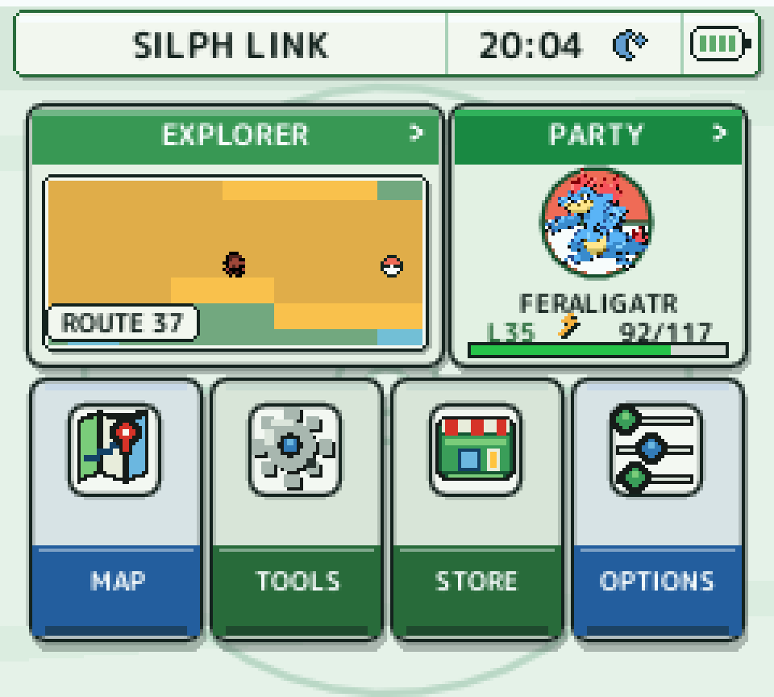
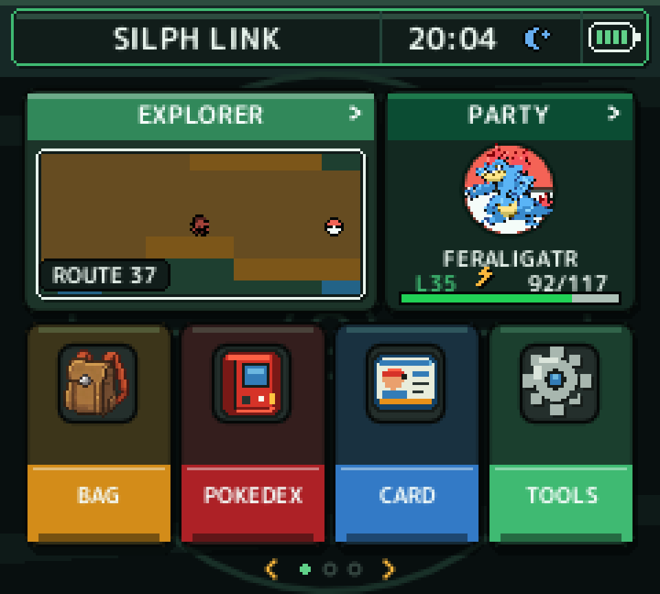
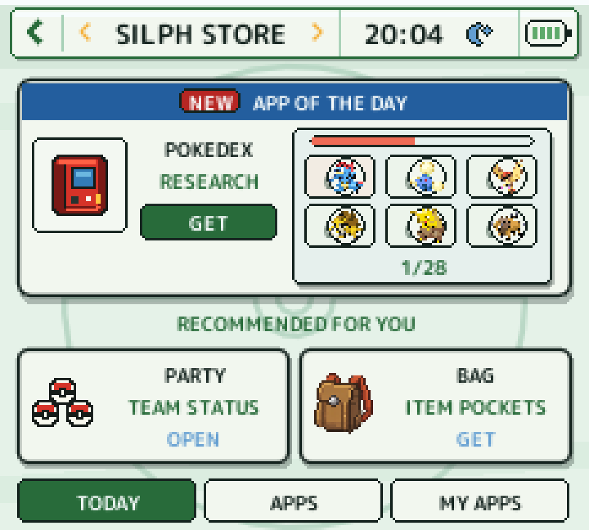
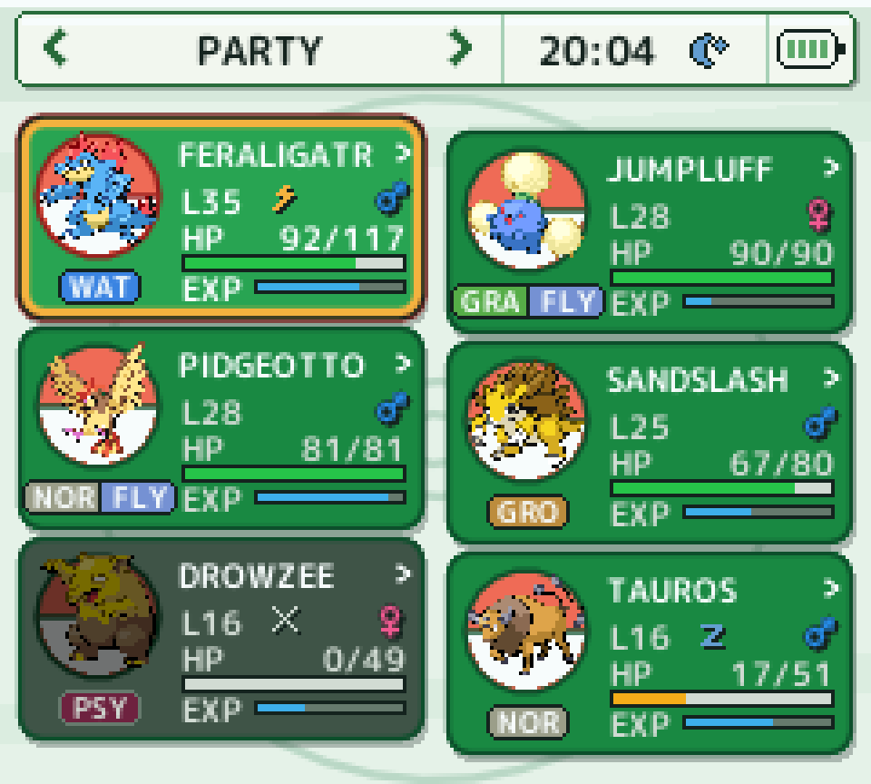

# Kanto Gear

### Silph Link OS — Your adventure. Reconnected.

A Nintendo DS-inspired companion OS for Pokémon Red, Blue, Yellow, Gold,
Silver, Crystal, FireRed, LeafGreen and Emerald in [Gen1Recomp](https://github.com/bryanthaboi/gen1recomp).

  
  
  

  
  

  <strong><a href="https://bryanthaboi.github.io/gen1recomp-mod-index/">Install from Mod Index</a></strong>
  · <strong><a href="https://github.com/AverageConsumer/kanto-gear/releases/latest">Download ZIP</a></strong>
  · <strong><a href="https://github.com/AverageConsumer/kanto-gear/issues">Report a problem</a></strong>

## Your companion in Kanto, Johto and Hoenn

Keep the adventure on the game screen and everything you need close at hand.
Kanto Gear brings maps, party information and touch controls together in a
customizable Home screen, with **HGSS Light, Dark and Auto** themes.

- **Explore:** follow your live map, find local encounters and check trainers,
  items and hidden finds. Choose Vanilla, Enhanced or Spoilers to set how much
  help you want.
- **Plan your team:** browse your Party, Bag and Pokédex, check move details and
  find places to catch the Pokémon you are looking for.
- **Track your adventure:** earn route stamps, see what is left to do and keep
  your own notes, checklists and colored sketches.
- **Make it yours:** arrange apps and widgets on Home. Long-press to edit and
  visit Silph Store to enable the optional tools you want.
- **Battle your way:** use contextual touch menus, keep the original layout or
  choose Gear and Full Gear to move more of the battle interface below.
- **See who is around:** Silph Connect shows online presence in an app and Home
  widget. It is an early display-only feature; friends, invites, trades,
  battles and chat need further support from Gen1Recomp.

  
  

## Get started

1. Install the [latest official Gen1Recomp](https://github.com/bryanthaboi/gen1recomp/releases/latest)
   and import your own supported ROM.
2. Install **Kanto Gear** from the [Mod Index](https://bryanthaboi.github.io/gen1recomp-mod-index/),
   or import the ZIP from the [latest release](https://github.com/AverageConsumer/kanto-gear/releases/latest).
3. Enable the mod, start your game and choose your display layout in Gear's
   **Options** app.

The same mod ZIP works on Android, Windows and Linux. Kanto Gear contains no
ROM or save file.

| Games | Minimum Gen1Recomp version |
| --- | --- |
| Red, Blue and Yellow | 0.3.20 |
| Gold, Silver and Crystal | 0.3.20 |
| FireRed and LeafGreen | 0.3.20 |
| Emerald (US 1.0) | 0.3.33 |

**Gen 3 support is still early.** Emerald, FireRed and LeafGreen have not been
extensively playtested yet. Feedback from your playthroughs is very welcome!
Some specialized menus stay on the original game screen. Ruby and Sapphire
are not currently supported. See [Gen 3 coverage](tools/GEN3.md) for details.

## One screen or two

| Layout | Best for |
| --- | --- |
| **Fullscreen Swap** | Phones and small handhelds; switch between the game and Gear |
| **Combined Screen** | Both views in one window, stacked, side by side or as an overlay |
| **Separate Screens** | Dual-screen handhelds, desktop windows and multiple monitors |

Use touch or a mouse, swipe between pages or tap the visible arrows. Supported
native menus also follow the game's D-pad selection. **Auto Battle Screen** can
switch the main view for battle choices on single-screen layouts.

## Languages and notes

English, German, Spanish (Spain), French and Japanese are available under
**Options → Appearance → Language**. Some newer labels still fall back to
English. Gear's language setting changes its own interface; translating the
game itself requires a separate game translation mod.

Notes supports QWERTY and QWERTZ keyboards, checklists and colored drawing.
Drawing needs continuous pointer input from the host. If your secondary
screen reports missing live drawing input, text notes and checklists still
work. Notes are saved separately for each playthrough.

## Feedback

Found something that feels wrong? [Open an issue](https://github.com/AverageConsumer/kanto-gear/issues)
with your game, device, Recomp and Gear versions, display mode and other active
mods. A screenshot and the steps to reproduce it help a lot.

For update history, see the [release notes](https://github.com/AverageConsumer/kanto-gear/releases).
More details: [languages](translations/README.md) · [Silph Connect](tools/PSS.md) ·
[Gen 3 support](tools/GEN3.md).

## Credits

Kanto Gear is built on [Gen1Recomp](https://github.com/bryanthaboi/gen1recomp)
and released under the [MIT License](LICENSE). Spanish was contributed by
**Desierto La Espada**, French by **Blastheaven2** and Japanese by **Theeohn**.
Special thanks to [@Rocky5150](https://github.com/Rocky5150) for extensive device testing.

Font credits:

- **Fusion Pixel** and **Ark Pixel** by **TakWolf**.
- **Misaki** by **Num Kadoma**, **Miseki Bitmap** by **Mark Li**,
  **Boutique Bitmap 7x7/9x9** by **Cen-cyun Liu / Luke Liu**, and
  **Galmuri** by **Lee Minseo (quiple)** contribute to the bundled Fusion fonts.
- The HGSS image fonts use **BobsGame nD** by **Robert Matthew Pelloni** and
  **scientifica** by **Akshay Oppiliappan**.

See [font credits and license locations](mod/kanto_gear/FONT_CREDITS.txt).
The downloadable ZIP includes these credits and the complete font license
notices. Font assets retain their respective licenses.

The green-and-amber bag icon is an original design drawn directly by Kanto
Gear's UI code. See [asset notes](mod/kanto_gear/ASSET_CREDITS.txt).

Pokémon and related names are trademarks of their respective owners. This fan
project is not affiliated with Nintendo, Game Freak, The Pokémon Company or
Gen1Recomp.
